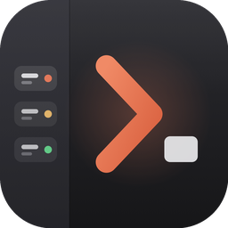

<p align="center">
  
</p>

<h1 align="center">herdrm</h1>
<p align="center"><strong>Every coding agent, every machine, one native terminal.</strong></p>
<p align="center">
  The native macOS console for <a href="https://herdr.dev">herdr</a> — see Claude Code, Codex,
  Gemini, Grok and OpenCode across your Mac and every SSH box you own, and jump into any one
  of them at full-TUI fidelity.
</p>

<p align="center">
  <a href="https://github.com/missuo/herdrm/releases/latest"></a>
  <a href="#requirements"></a>
  <a href="https://github.com/missuo/herdrm/releases"></a>
  <a href="#contributing"></a>
</p>

---

> [!WARNING]
> Early stage software without full test coverage — expect bugs. PRs are very welcome!

<p align="center">
  
</p>

## What it does

[herdr](https://herdr.dev) is the runtime your coding agents live on: a background server
that owns their terminals, keeps them running, and knows which one is working, blocked, or
done. **herdrm** puts a native macOS window on top of it, and it already does a lot more than
"attach to a terminal":

### Every machine, one sidebar
- **All your devices, in parallel** — local herdr plus any number of remote machines over SSH
  (the remote socket is forwarded through `ssh -L`, so everything works identically). Every
  device stays connected on its own reconnect loop (1s → 30s backoff) with OS detection that
  retries on every successful connection; the sidebar aggregates them all with a tinted OS
  badge marking where each row lives, and the bottom-left switcher filters by device.
- **Flexible SSH targets** — `user@host`, `user@host:port` (or a bare `ssh://` URI), and
  `~/.ssh/config` aliases all work. Auth falls back through OpenSSH keys/agent → **Tailscale
  SSH** (1.98.0+, for Unix-socket forwarding over the tailnet) → an in-app password prompt
  that's stored in the **macOS login Keychain**, never in a file or a process argument.
- **Diagnosable failures, not dead ends** — a remote whose herdr isn't running reports exactly
  that ("herdr isn't running on `<host>` — start it by running `herdr`"), a stale socket or
  `AllowStreamLocalForwarding` misconfiguration is called out by name, and an action against a
  disconnected device says *why* it's unreachable instead of a bare "not connected".

### Spaces & Agents, always current
- **Spaces & Agents sidebar** — every herdr workspace and every agent (claude, codex, gemini,
  grok, opencode, …) with live status: blocked agents bubble to the top, working ones spin,
  done ones get a check — the same canonical order the ⌘K palette uses.
- **New Agent, New Space** — the picker only offers CLIs actually installed on that device
  (including ones installed via NVM or a user-level installer, even when herdrm starts outside
  a login shell), and enables each agent's own bypass-permissions flag by default (e.g.
  `--dangerously-skip-permissions` for claude). New Space ships an inline directory browser —
  type, click to descend, arrow-up to the parent, filter as you type — that works over SSH too.
  Both are one keystroke away: **⌘N** for a new agent, **⇧⌘N** for a new space.
- Spaces can be renamed straight from the sidebar's context menu.

### A real terminal, not a chat wrapper
- **Live terminal** — selecting an agent attaches directly to its PTY (`herdr agent attach`).
  Full TUI, precise cursor, no chat wrapper — and the terminal grabs keyboard focus the moment
  you jump to an agent from ⌘K, the sidebar, or a notification.
- **Native text selection** — drag to select like a normal text view, no Shift required; a
  plain click clears the selection; ⌘C copies. Right-click gives you Copy / Paste / Select All,
  plus Open Link / Copy Link Address when the selection is a URL (double-click selects the
  whole link, ⌘-click opens it).
- **Legibility controls** — Thin strokes (on by default) turns off the macOS font smoothing
  that makes agent output look heavy and smudged, plus a font Weight (Light/Regular/Medium) and
  Line spacing (100%–140%) setting.
- **Shift+Enter inserts a line break** instead of submitting, and colors adapt correctly in
  Light mode — truecolor and 256-color output is luminance-flipped so nothing goes invisible on
  a white background, while colors that already read well (red, blue, magenta, black) keep
  their original hue.
- **Resilient sessions** — a dropped SSH connection or a takeover by another client covers the
  pane with an explanation and a Reconnect button instead of freezing on the last frame while
  still eating your keystrokes; a mixed-version PATH (two `herdr` binaries) no longer breaks
  attach with `protocol_mismatch`.

### Files, search, and staying in the loop
- **Paste files and images** straight into a Claude Code, Codex, or Copilot pane. Local devices
  forward the paste as Ctrl+V so the agent reads the clipboard itself; remote devices stream
  the file over SSH into a private, self-pruning cache (`~/.cache/herdrm/attachments`, 7-day
  retention, 50 MB cap) and paste the resulting path, shell-quoted so spaces survive. Which
  agents accept attachments comes from a capability registry, agent-aware out of the box.
- **Search** — ⌘K command palette across agents and spaces on every device, ordered by urgency
  (needs input → done → working → idle) with a status glyph per row, scrolling to follow the
  keyboard selection and always reopening at the top.
- **Notifications** — a system notification (with its own sound) when any agent on any device
  finishes or needs your input; clicking it jumps straight to that agent. Agents you're
  actively watching never notify, and Settings surfaces the OS permission state with a
  one-click request.

### Built like a native Mac app
- **Universal binary** — Apple Silicon and Intel, one download.
- **Light & dark**, auto-updates via [Sparkle](https://sparkle-project.org), signed and
  notarized.
- **HerdrKit** — the socket-RPC/SSH/device layer ships as its own Swift package
  (`Packages/HerdrKit`), independent of the SwiftUI app, so the protocol and transport code is
  reusable and unit-testable on its own.

## Why herdrm?

If you run more than one coding agent, or one agent on more than one machine, you already know
the friction: a grid of terminal tabs with no shared sense of who's blocked, a chat UI that
can't show you the actual TUI, and no way to know an agent finished until you tab back over.

- **One console, every machine.** Your laptop, your dev box, a home server — herdrm treats them
  as rows in the same sidebar, not separate terminal windows you have to remember to check.
- **The real terminal, not a summary of it.** herdrm attaches to the agent's actual PTY. What
  you see is exactly what `herdr agent attach` would show you in a shell — cursor position,
  color, TUI redraws — because that's what it is.
- **You stop polling.** Status lives in the sidebar and in system notifications instead of in
  your head. Blocked-and-waiting-on-you agents surface automatically, everywhere: sidebar, ⌘K,
  and the notification center.
- **It gets out of the way.** ⌘K to jump anywhere, ⌘N/⇧⌘N to start something new, paste a
  screenshot straight into the pane you're looking at. No new mental model to learn on top of
  the terminal you already know.

## Requirements

- macOS 14+
- [herdr](https://herdr.dev) installed locally — herdrm starts the local server itself if it
  isn't already running — and running on your remote machines
- For remote devices: OpenSSH access through your SSH config/agent, Tailscale SSH (1.98.0+ on
  the remote host), or a password stored in the macOS login Keychain. Targets accept
  `user@host`, `user@host:port`, and `~/.ssh/config` aliases.

## Install

### Homebrew

```sh
brew install owo-network/brew/herdrm
```

### Manual

Download the latest `herdrm-x.y.z.zip` from
[Releases](https://github.com/missuo/herdrm/releases), unzip, and drag `herdrm.app` into
`/Applications`. Either way the app updates itself from then on — check **HerdrM → Check for
Updates…** any time, or **HerdrM → About HerdrM** for the version you're running.

## Quick Start

1. **Launch herdrm.** No local herdr running yet? herdrm starts it for you.
2. **Add a remote device** (optional) — bottom-left device switcher → Add Device — with any of:
   ```sh
   # a plain SSH target
   you@dev-box
   # a custom port
   you@dev-box:2222
   # a Tailscale machine (Tailscale SSH, no keys needed)
   you@my-tailnet-host
   ```
3. **Start an agent** — ⌘N, pick a device and a CLI (only what's actually installed there shows
   up), and you're attached to its live terminal.
4. **Jump around** — ⌘K to find any agent across every device, or just watch the sidebar: it'll
   tell you the moment one is blocked on you.

## Architecture

```
   herdr (background server, owns the PTYs)
        ▲  NDJSON-over-Unix-socket RPC, and `herdr agent attach` for the live stream
        │
   Packages/HerdrKit   — Swift package: RPC client, SSH tunneling, device store
        ▲
        │  SwiftUI bindings
   Sources/HerdrM       — the app: sidebar, terminal embed, notifications, search
```

- **[herdr](https://herdr.dev)** is the daemon: it owns every agent's PTY, persists spaces, and
  answers over a local Unix socket (forwarded from remote machines with `ssh -L`).
- **`Packages/HerdrKit`** is the transport and domain layer — the RPC client, `SSHTunnel`,
  device persistence — kept independent of any UI so it's unit-tested on its own
  (`make kit-test`).
- **`Sources/HerdrM`** is the SwiftUI shell: the Spaces/Agents sidebar, the
  [SwiftTerm](https://github.com/migueldeicaza/SwiftTerm)-backed terminal embed, notifications,
  and the ⌘K search.

## Build from source

```sh
brew install xcodegen
make build   # xcodegen + xcodebuild → build/Build/Products/Debug/herdrm.app
make run
make kit-test  # HerdrKit integration tests (needs a running local herdr)
```

## Contributing

This is early-stage software and PRs are genuinely welcome — small, single-purpose ones land
fastest.

- **Found a bug?** [Open an issue](https://github.com/missuo/herdrm/issues/new) with your
  macOS version, the herdr version (`herdr --version`), and the steps that trigger it.
- **Have a feature in mind?** Open an issue describing the workflow it unblocks before sending
  a large PR — it's the fastest way to find out if it fits the project's direction.
- **Sending a PR:** fork, branch, `make build` and `make kit-test` locally (there's no CI gate
  yet, so this is the bar), and add a line under `## [Unreleased]` in `CHANGELOG.md` — release
  automation extracts that section for the GitHub release notes and the Sparkle update
  description, and fails the build without it.

## Credits

- [herdr](https://herdr.dev) — the terminal workspace manager for coding agents that this app
  is a console for.
- [Heeler](https://github.com/ZingerLittleBee/Heeler) — the iOS herdr client; herdrm borrows
  its domain model and transport patterns.
- [waku](https://github.com/egoist/waku) — the sidebar design reference.
- [SwiftTerm](https://github.com/migueldeicaza/SwiftTerm) — terminal emulation.
- [Sparkle](https://sparkle-project.org) — auto-updates.
- [Lobe Icons](https://github.com/lobehub/lobe-icons) and
  [Simple Icons](https://simpleicons.org) — agent and OS brand icons.

## Star History

<p align="center">
  <a href="https://star-history.com/#missuo/herdrm&Date">
    <picture>
      <source media="(prefers-color-scheme: dark)" srcset="https://api.star-history.com/svg?repos=missuo/herdrm&type=Date&theme=dark" />
      <source media="(prefers-color-scheme: light)" srcset="https://api.star-history.com/svg?repos=missuo/herdrm&type=Date" />
      
    </picture>
  </a>
</p>
